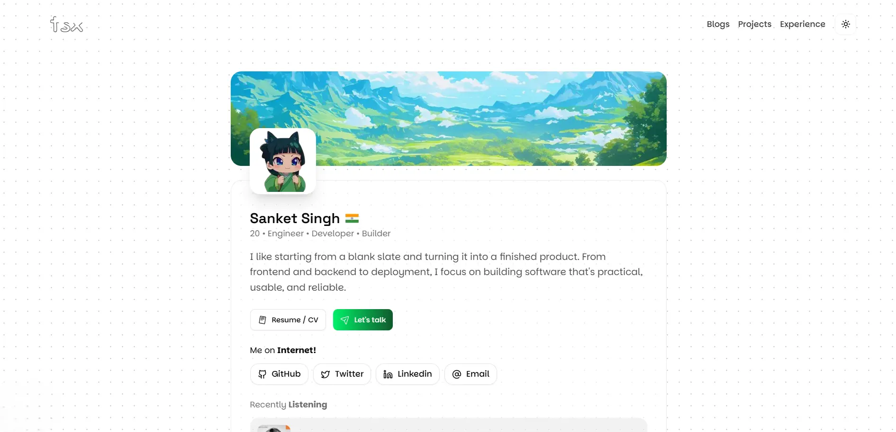

# Personal Portfolio Website

A minimal, high-performance personal portfolio website designed to showcase my projects, writing, and technical skills. Built with a focus on clean UI/UX, smooth animations, and accessibility. 
<br></br>

🔗 **Live Demo:** [tsx sanket](https://www.tsxsanket.in/)

## ✨ Key Features

- **⚡ Modern Stack:** Built with Nextjs, TypeScript and Tailwind CSS for speed and maintainability.
- **🎨 Minimalist Design:** Clean aesthetic with a focus on typography and whitespace.
- **animate:** Smooth page transitions and component animations using **Framer Motion**.
- **📱 Fully Responsive:** Optimized for all devices, from large desktops to mobile phones.

## 🛠️ Tech Stack

- **Framework:** [NextJS](https://nextjs.org/) (Nextjs)
- **Styling:** [Tailwind CSS](https://tailwindcss.com/)
- **Animations:** [Framer Motion](<[https://www.framer.com/motion/](https://motion.dev/)>)
- **Icons:** [Animated Lucide Icons](https://lucide-animated.com/)
- **UI Library** [Shadcn](https://ui.shadcn.com/)

## 🚀 Getting Started

Follow these steps to set up the project locally on your machine.

### Prerequisites

- Node.js (v18 or higher)
- bun or npm

### Installation

1.  **Clone the repository**

    ```bash
    git clone [https://github.com/sanketsingh01/portfolio](https://github.com/sanketsingh01/portfolio)
    cd portfolio
    ```

2.  **Install dependencies**

    ```bash
    bun install
    # or
    npm install
    ```

3.  **Start the development server**

    ```bash
    bun run dev
    ```

4.  Open [http://localhost:3000](http://localhost:3000) with your browser to see the result.
